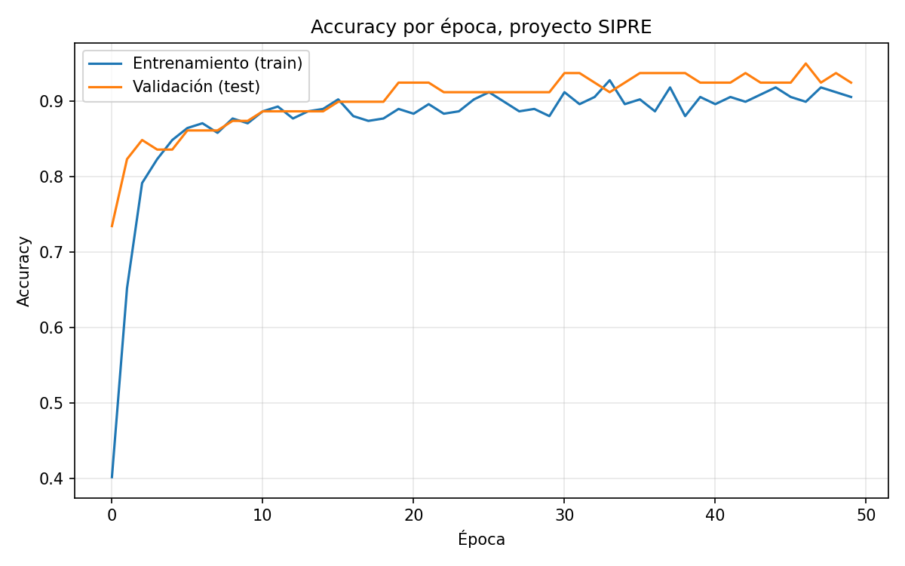
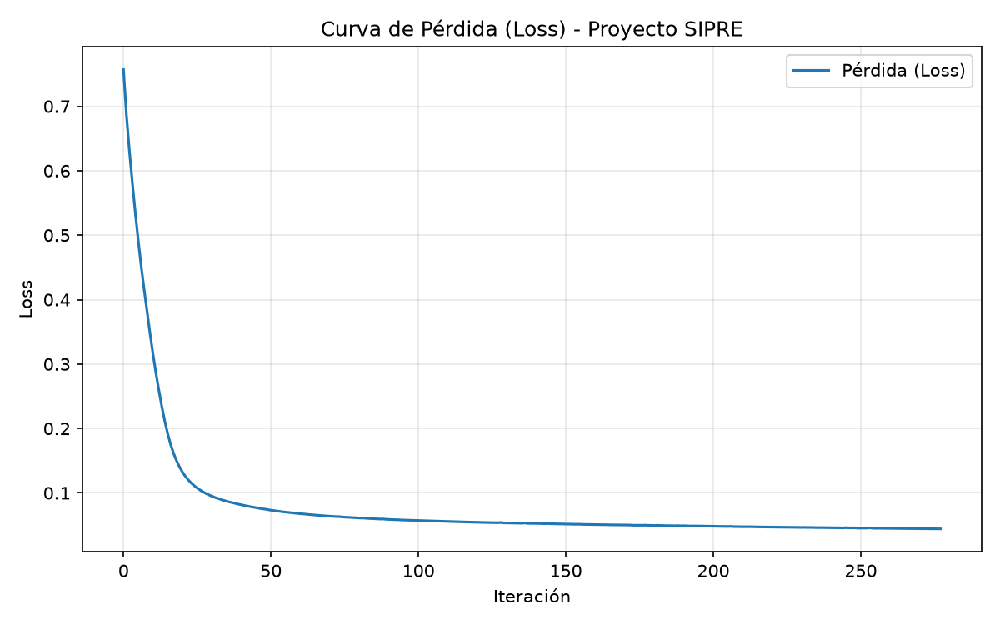
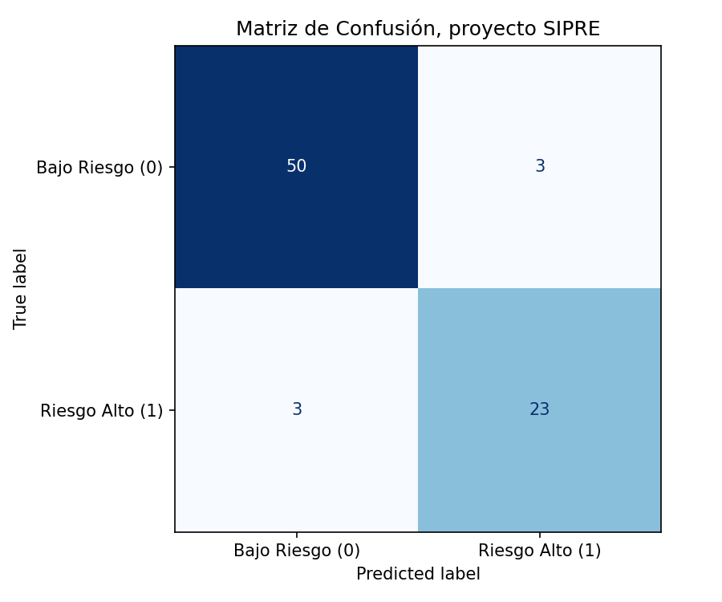
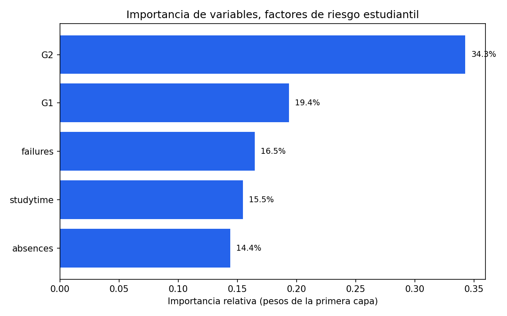

```{python}
#| label: setup
#| include: false
import sys, os
sys.path.append(os.path.join(os.getcwd(), ".."))

from pipeline.preprocess import preparar_pipeline_completo
from model.train import entrenar_modelo, graficar_entrenamiento, guardar_modelo
from evaluation.metrics import evaluar_modelo, graficar_matriz_confusion
from explainability.explain import calcular_importancia_variables, graficar_importancia

BASE_DIR = os.path.join(os.getcwd(), "..")
RUTA_CSV = os.path.join(BASE_DIR, "data", "student-mat.csv")
CARPETA_OUTPUTS = os.path.join(BASE_DIR, "outputs")
```

## 1. Planteamiento del problema

La deserción y el bajo rendimiento académico son problemas críticos en
educación secundaria: cuando un tutor detecta el riesgo demasiado tarde, ya
no hay margen para intervenir. El proyecto **SIPRE** aborda este problema
como una tarea de **clasificación binaria supervisada**: dado el historial
de un estudiante (tiempo de estudio, materias reprobadas, ausencias y notas
de los dos primeros parciales), predecir si terminará el curso en **Riesgo
Alto** (nota final G3 < 10) o en **Bajo Riesgo** (G3 ≥ 10).

El valor del sistema no está solo en la predicción final, sino en
convertirla en una **herramienta de alerta temprana**: entre más
anticipadamente se detecte el riesgo, más margen de acción tiene la
institución para intervenir (tutorías, refuerzo, seguimiento).

## 2. Análisis exploratorio de datos (EDA)

Se utilizó el dataset **Student Performance** (UCI Machine Learning
Repository, Cortez & Silva, 2008), específicamente `student-mat.csv`
(rendimiento en la asignatura de Matemáticas), con 395 estudiantes de dos
escuelas portuguesas y 33 atributos originales (demográficos, sociales,
familiares y académicos).

```{python}
#| label: eda
import pandas as pd
df_crudo = pd.read_csv(RUTA_CSV, sep=";")
print("Dimensiones del dataset original:", df_crudo.shape)
df_crudo[["studytime", "failures", "absences", "G1", "G2", "G3"]].describe()
```

Puntos clave observados:

- Las **ausencias** tienen un rango muy amplio (0 a 93), mientras que el
  **tiempo de estudio** solo va de 1 a 4 — una diferencia de escala que
  justifica la normalización posterior.
- Las notas **G1** y **G2** (parciales) están altamente correlacionadas con
  **G3** (nota final), lo cual es esperado y es justamente lo que permite
  usarlas como señal predictiva temprana.
- La proporción de estudiantes en riesgo (G3 < 10) frente a los que no lo
  están es de aproximadamente **33% vs 67%**: un desbalance moderado, no
  severo, que no requirió técnicas especiales de balanceo (como SMOTE),
  aunque sí se usó `stratify` al dividir train/test para mantener la
  proporción de clases.

## 3. Preparación y limpieza de datos

```{python}
#| label: preprocesamiento
datos = preparar_pipeline_completo(RUTA_CSV)
print("Estudiantes tras limpieza:", len(datos["df_limpio"]))
print(datos["df_limpio"]["riesgo"].value_counts())
```

Pasos aplicados (`pipeline/preprocess.py`):

1. **Carga**: lectura con `sep=";"` (el archivo usa punto y coma como
   separador, no coma).
2. **Limpieza**: eliminación de duplicados y valores nulos, aplicada sobre
   el dataset **completo** (33 columnas) antes de reducir variables — de lo
   contrario, dos estudiantes distintos que compartan casualmente los
   mismos 5 valores de entrada se habrían tratado como "duplicados" y
   se habría perdido información real.
3. **Creación de la variable objetivo `riesgo`**: `1` si `G3 < 10`, `0` en
   caso contrario.
4. **Eliminación de G3** de las variables de entrada una vez creado
   `riesgo`, para evitar *data leakage* (que el modelo "tramposee" viendo
   directamente la nota que determina la etiqueta).
5. **División train/test** (80/20, estratificada por `riesgo`).
6. **Normalización con `StandardScaler`** (ajustado solo con el set de
   entrenamiento) para que todas las variables queden con media 0 y
   desviación estándar 1.

## 4. Ingeniería de características (Feature Engineering)

Se seleccionaron 5 variables de entrada, elegidas por su relación directa
y comprobada con el rendimiento académico:

| Variable | Descripción |
|---|---|
| `studytime` | Tiempo de estudio semanal (1 a 4) |
| `failures` | Número de materias reprobadas previamente |
| `absences` | Ausencias acumuladas |
| `G1` | Nota del primer parcial |
| `G2` | Nota del segundo parcial |

No se usaron variables demográficas (sexo, dirección, educación de los
padres, etc.) para mantener el modelo enfocado en **factores accionables**
desde la institución (asistencia, hábitos de estudio, desempeño temprano),
evitando además introducir sesgos socioeconómicos en un sistema que
influye en decisiones sobre estudiantes reales.

## 5. Entrenamiento del modelo

Arquitectura MLP (`model/build_model.py`):

- Capa de entrada: 5 features
- Capa oculta 1: `Dense(32, relu)`
- `Dropout(0.3)` — regularización para prevenir sobreajuste
- Capa oculta 2: `Dense(16, relu)`
- Capa de salida: `Dense(1, sigmoid)` — probabilidad de riesgo alto

Entrenado con optimizador Adam, pérdida `binary_crossentropy`, 50 épocas,
batch size 16.

```{python}
#| label: entrenamiento
#| output: false
modelo, historial = entrenar_modelo(
    datos["X_train"], datos["y_train"], datos["X_test"], datos["y_test"], verbose=0
)
graficar_entrenamiento(historial, CARPETA_OUTPUTS)
guardar_modelo(modelo, os.path.join(CARPETA_OUTPUTS, "model.h5"))
```

::: {layout-ncol=2}



:::

Ambas curvas (entrenamiento y validación) convergen juntas sin separarse
significativamente, lo cual indica que **el modelo no está sobreajustando**
gracias al Dropout y al tamaño razonable de la red para este volumen de
datos.

## 6. Evaluación y métricas

```{python}
#| label: evaluacion
resultados = evaluar_modelo(modelo, datos["X_test"], datos["y_test"])
print(f"Accuracy : {resultados['accuracy']:.3f}")
print(f"Precision: {resultados['precision']:.3f}")
print(f"Recall   : {resultados['recall']:.3f}")
print(f"F1-Score : {resultados['f1']:.3f}")
print(resultados["reporte_texto"])
graficar_matriz_confusion(resultados["matriz_confusion"], CARPETA_OUTPUTS)
```

{width=60%}

**Pregunta de reflexión: ¿qué es más grave, un Falso Positivo o un Falso
Negativo?**

- **Falso Positivo** (el sistema marca riesgo y el estudiante en realidad
  iba a aprobar): el costo es una intervención pedagógica de más — tiempo
  y recursos del tutor invertidos en un estudiante que no lo necesitaba
  con urgencia.
- **Falso Negativo** (el sistema dice "está bien" y el estudiante
  reprueba): el costo es mucho mayor — se pierde la ventana de
  intervención temprana y el estudiante fracasa sin haber recibido apoyo.

En un contexto educativo, **el Falso Negativo es el error más grave**,
porque el objetivo del sistema es prevenir, no solo diagnosticar
correctamente en promedio. Por eso el **Recall de la clase "Riesgo Alto"**
es la métrica más importante a monitorear (no basta con mirar el Accuracy
global), y de ser necesario se podría bajar el umbral de decisión de 0.5 a
un valor menor para capturar más casos de riesgo real, aceptando algunos
Falsos Positivos adicionales a cambio.

## 7. Interpretación de resultados (Explicabilidad)

```{python}
#| label: explicabilidad
importancia = calcular_importancia_variables(modelo, datos["feature_columns"])
for nombre, valor in sorted(importancia.items(), key=lambda x: -x[1]):
    print(f"{nombre:12s}: {valor*100:5.1f}%")
graficar_importancia(importancia, CARPETA_OUTPUTS)
```

{width=70%}

Los pesos de la primera capa muestran que **G2 (segundo parcial)** es, por
un margen amplio, el factor que más influye en la predicción, seguido de
**G1**. Esto es coherente con la realidad académica: el desempeño más
reciente es el mejor predictor del desempeño futuro cercano. `failures` y
`studytime` aportan una señal complementaria — un estudiante con historial
de materias reprobadas o poco tiempo de estudio semanal, incluso con notas
parciales aceptables, sigue mostrando riesgo elevado. `absences` es el
factor de menor peso relativo en este modelo, aunque sigue siendo
significativo.

**Impacto ético**: un sistema como SIPRE debe usarse como apoyo a la
decisión humana del tutor, nunca como filtro automático que etiquete o
excluya estudiantes sin revisión. Al no incluir variables demográficas o
socioeconómicas, se reduce (aunque no se elimina) el riesgo de que el
modelo perpetúe sesgos existentes en los datos históricos.

## 8. Conclusiones y recomendaciones

- El modelo alcanza un desempeño sólido (Accuracy ≈ 0.91, Recall de la
  clase de riesgo ≈ 0.88 en este entrenamiento), suficiente para servir
  como herramienta de apoyo, no de decisión final.
- Los dos parciales (G1, G2) concentran la mayor parte de la señal
  predictiva; en cursos donde no hay notas parciales tempranas, el modelo
  tendría que apoyarse más en asistencia y hábitos de estudio, y
  probablemente perdería precisión.
- Se recomienda a la institución usar la salida del modelo como **alerta**,
  acompañada siempre de criterio humano del tutor antes de cualquier
  intervención.
- Dado que el Falso Negativo es el error más costoso en este dominio, se
  recomienda evaluar en producción un umbral de decisión menor a 0.5 para
  la clase "riesgo", priorizando Recall sobre Precision.

## 9. Trabajo futuro

- Incorporar más variables del dataset original (por ejemplo, `Dalc`/`Walc`
  — consumo de alcohol, `goout` — salidas sociales, `famsup` — apoyo
  familiar) y evaluar si mejoran el Recall sin introducir sesgos
  problemáticos.
- Probar arquitecturas alternativas (más capas, regularización L2) y
  comparar contra modelos más simples (regresión logística, árboles) como
  línea base.
- Aplicar técnicas de explicabilidad más rigurosas (SHAP) en vez de la
  aproximación por pesos de la primera capa.
- Validar el modelo con datos de otras instituciones para medir qué tanto
  generaliza fuera del contexto de las dos escuelas portuguesas originales.
- Desplegar la app de Streamlit en un entorno accesible para tutores reales
  y recoger retroalimentación de uso en campo.

---

*Fuente de datos: Cortez, P., & Silva, A. (2008). Student Performance.
UCI Machine Learning Repository.*
